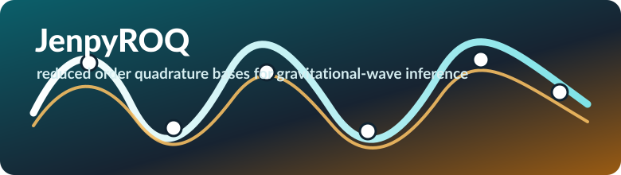

JenpyROQ
========

``JenpyROQ`` constructs reduced order quadrature bases and empirical
interpolation nodes for gravitational-wave likelihood acceleration. It is an
extended, streamlined and modularised version of ``PyROQ`` with support for multiple
waveform families, configurable greedy enrichment cycles, linear and quadratic
basis construction, diagnostic plots, and serial, multiprocessing or MPI
execution.

.. raw:: html

   

     <a href="introduction.html">Introduction</a>
     <a href="install_and_run.html">Install & run</a>
     <a href="configuration.html">Configuration</a>
     <a href="roq_workflow.html">ROQ workflow</a>
     <a href="waveform_models.html">Waveform models</a>
     <a href="output_diagnostics.html">Outputs</a>
     <a href="examples.html">Examples</a>
   

.. toctree::
   :maxdepth: 1
   :caption: Start here:

   introduction
   install_and_run
   examples

.. toctree::
   :maxdepth: 1
   :caption: Configuration & Algorithms:

   configuration
   roq_workflow
   waveform_models
   output_diagnostics

.. toctree::
   :maxdepth: 1
   :caption: Development:

   development
   modules

Indices & Tables
----------------

:ref:`genindex` | :ref:`search`
