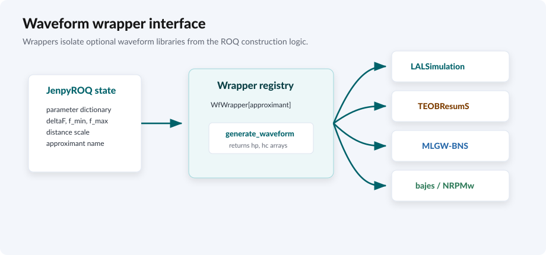

Waveform Models
---------------

``JenpyROQ`` separates ROQ construction from waveform generation through
wrapper classes in ``JenpyROQ/waveform_wrappers.py``. A wrapper is responsible
for accepting a parameter dictionary and returning ``h_+`` and ``h_x`` on the
requested frequency grid.

.. rst-class:: jenpyroq-doc-figure-container

   The ROQ algorithm calls one common wrapper interface while the wrapper
   handles library-specific waveform generation.

The wrapper contract is:

.. code-block:: python

   class MyWrapper:
       def __init__(self, approximant, additional_waveform_params=None):
           ...

       def generate_waveform(self, p, deltaF, f_min, f_max, distance):
           ...
           return hp, hc

Available Approximant Names
~~~~~~~~~~~~~~~~~~~~~~~~~~~

The command-line help lists the intended user-facing approximants. The source
registers a wrapper only when the corresponding optional dependency can be
imported.

.. list-table::
   :header-rows: 1
   :widths: 30 30 30

   * - Approximant family
     - Names
     - Dependency
   * - LALSimulation
     - ``IMRPhenomD``, ``IMRPhenomPv2``, ``IMRPhenomPv3``,
       ``IMRPhenomPv3HM``, ``IMRPhenomXHM``, ``IMRPhenomXPHM``,
       ``TaylorF2Ecc``, ``IMRPhenomPv2_NRTidal``, ``IMRPhenomNSBH``
     - ``lal`` and ``lalsimulation``
   * - TEOBResumS
     - ``teobresums-giotto``
     - ``EOBRun_module``
   * - MLGW-BNS standalone
     - ``mlgw-bns-standalone``
     - ``mlgw_bns``
   * - bajes inspiral
     - ``mlgw-bns``
     - ``bajes``
   * - NRPMw and hybrids
     - ``nrpmw``, ``nrpmw-recal``, ``nrpmw-merger``,
       ``nrpmw-recal-merger``, ``teobresums-spa-nrpmw``,
       ``teobresums-spa-nrpmw-recal``, ``mlgw-bns-nrpmw``,
       ``mlgw-bns-nrpmw-recal``
     - ``bajes`` and the relevant waveform backend

If an optional module is missing, the import prints a warning and that wrapper
is not registered. A run requesting an unregistered wrapper raises
``ValueError('Unknown approximant requested.')``.

Spin Handling
~~~~~~~~~~~~~

``spins`` and ``spin-sph`` decide which spin variables are sampled. The wrapper
still decides which of those variables the underlying waveform model can
handle.

.. list-table::
   :header-rows: 1
   :widths: 28 34 30

   * - Setting
     - Active variables
     - Notes
   * - ``spins = no-spins``
     - no spin variables
     - Wrappers fill missing spin components with zero where supported.
   * - ``spins = aligned``
     - ``s1z``, ``s2z``
     - The common path for BNS examples.
   * - ``spins = precessing`` and ``spin-sph = 0``
     - ``s1x``, ``s1y``, ``s1z``, ``s2x``, ``s2y``, ``s2z``
     - LAL precessing models can use these. MLGW-BNS and bajes wrappers reject
       non-zero in-plane spins.
   * - ``spins = precessing`` and ``spin-sph = 1``
     - ``s1s1`` through ``s2s3``
     - Converted internally to Cartesian components before waveform calls.

Tidal And Eccentricity Parameters
~~~~~~~~~~~~~~~~~~~~~~~~~~~~~~~~~

``tides = 1`` activates ``lambda1`` and ``lambda2``. Several BNS wrappers
require these parameters. ``MLGW-BNS`` checks that the values lie between
``5`` and ``5000``. The bajes wrappers reject values above ``5000``.

``eccentricity = 1`` activates the ``ecc`` parameter only when paired with a
waveform model that supports the requested eccentric domain.

Post-Merger Parameters
~~~~~~~~~~~~~~~~~~~~~~

``post-merger = 1`` activates:

.. list-table::
   :header-rows: 1
   :widths: 28 20 38

   * - Parameter
     - Default range
     - Meaning
   * - ``nrpmw-tcoll``
     - ``[0, 3000]``
     - Collapse time parameter for NRPMw models.
   * - ``nrpmw-df2``
     - ``[-1e-5, 1e-5]``
     - NRPMw frequency-derivative parameter.
   * - ``nrpmw-phi``
     - ``[0, 2*pi]``
     - Post-merger phase used by attached or merger models.

For recalibrated NRPMw approximants, the code tries to import recalibration
parameter names and bounds from ``bajes``. Those extra parameters are added as
``nrpmw-<name>`` only when the import succeeds and the approximant name
contains ``nrpmw-recal``.

TEOB Dynamics Parameters
~~~~~~~~~~~~~~~~~~~~~~~~

``dynamics = 1`` activates:

.. list-table::
   :header-rows: 1
   :widths: 30 24 34

   * - Parameter
     - Default range
     - Meaning
   * - ``TEOBResumS_a6c``
     - ``[-100, -20]``
     - EOB dynamics parameter mapped to ``a6c`` before calling TEOBResumS.
   * - ``TEOBResumS_cN3LO``
     - ``[-100, -20]``
     - EOB dynamics parameter mapped to ``cN3LO`` before calling TEOBResumS.
